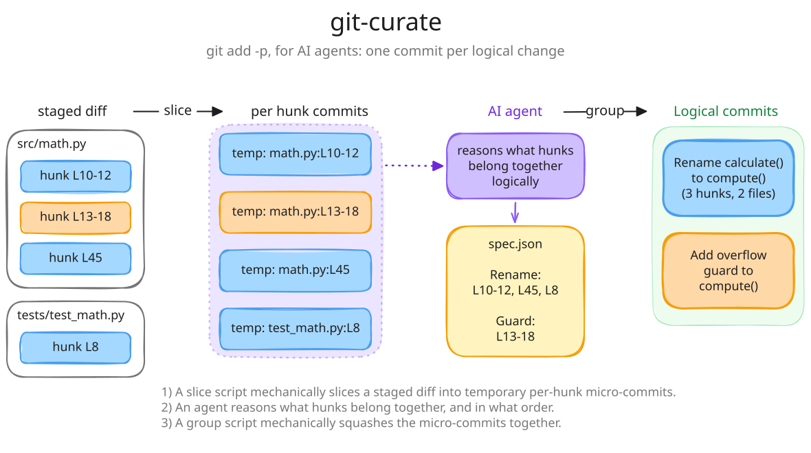

# git-curate

git-curate lets an AI agent commit at diff hunk granularity. A single file can produce several commits, one per logical change.

`git add -p / --patch` does this interactively. git-curate does it for agents.



## Logical commits are easier to understand

Reviewers need to know what changed and why. Focused commits answer that; large blobs don't.

Reviewing your colleague's changes and reviewing your AI agent's output are the same task: compress edits into a narrative a reader can follow. Logical commits serve both.

Existing tools stage whole files (`git add <file>`). They can't drive `git add -p`, the hunk-by-hunk staging workflow. AI-authored changes land as one massive commit per file, even when a file contains several independent logical changes. git-curate fixes that.

## How it works

The workflow has three steps:

1. **Slice**: `git-curate slice` creates one temporary commit per diff hunk, with no reasoning. Hunks are split the way `git add -p`'s `s` command splits them, and also at blank lines between sibling blocks of added or removed lines, such as two new functions. A new file is not split at blank lines unless you pass `--split-new-files`.
2. **Group** (AI): an AI agent reads the commit diffs and decides which hunks belong together, producing a JSON grouping spec.
3. **Finalize**: `git-curate group --spec <spec>` squashes the `temp:` commits into final commits via non-interactive rebase.

Run `git-curate` alone to execute all three steps, using Claude or pi as the model harness.

## Installation

Install with [uv](https://docs.astral.sh/uv/):

```bash
uv tool install 'git+https://github.com/alexbrasetvik/git-curate'

# If cloning to hack locally:
uv tool install --reinstall /path/to/git-curate
```

You can then run `git-curate`, `git curate`, or `uvx git-curate` depending on your shell setup. The skills use `uvx git-curate`.

Install the skill:

```bash
npx skills add /path/to/git-curate
```

## Usage

Run `uvx git-curate` or `git curate` with no options to run the full workflow:

- `uvx git-curate slice` commits each staged hunk separately.
- Claude Code or pi groups those commits into logical units.
- `uvx git-curate group` squashes them into the final commits.

Pick the harness with `--harness claude` or `--harness pi`, and its model with `--model`, e.g. `git curate --model=opus`. To set defaults, use `git config git-curate.harness` and `git config git-curate.model`. Without a model set, the harness uses its own default.

`git curate` also takes slice's splitting options, `--split-context`, `--hunk-per-line`, `--no-split-on-blank-lines` and `--split-new-files`; see `git curate slice --help`.

### Slicing

`slice` creates one commit per hunk, for `group` to later squash.

Stage your changes, then run:

```bash
uvx git-curate slice
```

**Staged vs. unstaged:** `slice` operates on whatever is staged. If nothing is staged but you have unstaged changes, pass `--all` to stage changes to tracked files first (untracked files are not added):

```bash
uvx git-curate slice --all
```

`slice` only touches staged changes. Unstaged files are left alone.

To limit slicing to specific files:

```bash
uvx git-curate slice src/auth.py src/schema.py
```

To give every changed line its own temp commit, such as an import block whose lines belong to different changes:

```bash
uvx git-curate slice --hunk-per-line src/auth.py
```

An edited line keeps its removed and added sides together, and a blank line joins the line before it. Adjacent lines conflict if reordered, so their final commits must follow the order of the lines in the file.

To preview without committing:

```bash
uvx git-curate slice --dry-run
```

### Grouping

After slicing, write the diff to disk for the agent:

```bash
uvx git-curate diff --tmp
```

`--tmp` writes the diff to `.git/git-curate-diff.patch` and prints `<path> <line-count>` on one line. The agent reads this file and produces a JSON grouping spec.

The spec is an ordered list of groups. Order determines the final commit order:

```json
[
  {
    "message": "Rename calculate() to compute()\n\nUpdates the method definition, all call sites, and tests.",
    "commits": [
      "temp: src/math.py:L10-12 #3f2a9c1e-1",
      "temp: src/math.py:L45-45 #b7d04e52-2",
      "temp: tests/test_math.py:L8-8 #0c9e7a13-3"
    ]
  },
  {
    "message": "Add overflow guard to compute()",
    "commits": [
      "temp: src/math.py:L13-18 #5e81d2fa-4"
    ]
  }
]
```

Commits are referenced by their full message, which must match exactly. `group` leaves any `temp:` commit not in the spec as-is. Non-`temp:` commits pass through unchanged.

Execute the spec:

```bash
uvx git-curate group --spec .git/git-curate-spec.json
```

`group` deletes the spec file on success; pass `--keep-spec` to keep it.

Verify the result, using the base SHA that `uvx git-curate status` printed before grouping:

```bash
uvx git-curate log <base>
```

## Architecture

### Why many small commits first

Squashing commits is trivial. Splitting them is hard. Mix flour and water into dough and you can't separate them back out.

`slice` errs toward maximum granularity. It splits hunks further at blank lines between blocks at the same indentation, so adjacent new functions or paragraphs land in separate `temp:` commits even with no unchanged lines between them. New files are the exception: their blocks usually belong in one commit, so they stay whole unless you pass `--split-new-files`. The agent then groups the hunks, a task that requires understanding code semantics.

### Division of labour

The tool handles mechanics: parsing unified diffs, computing correct hunk headers, building the temp commits with `git fast-import`, driving non-interactive rebase. These operations are deterministic and brittle; small errors corrupt history. They belong in tested code, not an LLM prompt.

The agent handles reasoning: deciding which hunks belong together and writing messages that explain intent. Language models handle this well; rule-based heuristics produce mediocre results. Each layer does what the other can't.

## Agent Skill

The repository includes a skill at [skills/git-curate/SKILL.md](skills/git-curate/SKILL.md). It covers invocation, staged vs. unstaged handling, spawning a focused sub-agent for grouping, and final log verification.

Invoke `/git-curate` in your agent session after making changes.

It works with Claude Code and pi.

The skill has access to the git-curate tools and `git log`. The git status and diff commands it needs are baked into `git-curate` to simplify permission handling.
